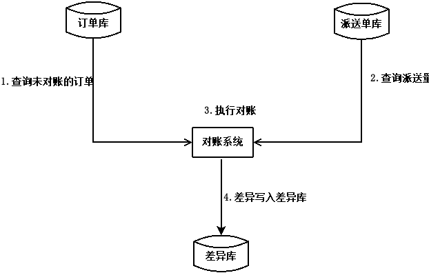

#【Java并发工具类】CountDownLatch和CyclicBarrier

> https://www.cnblogs.com/myworld7/p/12337246.html

## 一、前言

下面介绍协调让多线程步调一致的两个工具类：CountDownLatch和CyclicBarrier。

## 二、CountDownLatch和CyclicBarrier的用途介绍

### 1.CountDownLatch

```java
// API
 void		await(); // 使当前线程在闭锁计数器到零之前一直等待，除非线程被中断。
 boolean	await(long timeout, TimeUnit unit); // 使当前线程在闭锁计数器至零之前一直等待，除非线程被中断或超出了指定的等待时间。
 void		countDown(); // 递减闭锁计数器，如果计数到达零，则释放所有等待的线程。
 long		getCount(); // 返回当前计数。
 String		toString(); // 返回标识此闭锁及其状态的字符串。
```

CountDownLatch是一个同步工具类，在完成一组正在其他线程中执行的操作之前，它允许一个或多个线程一直等待。可以指定计数初始化CountDownLatch，当调用countDown()方法后，在当前计数到达零之前，await()方法会一直受阻塞。计数到达零之后，所有被阻塞的线程都会被释放，await()的所有后续调用都会立即返回。CountDownLatch的计数只能被使用一次，如果需要重复计数使用，则要考虑使用CyclicBarrier。

CountDownLatch的用途有很多。将计数为1初始化的CountDownLatch可用作一个简单的开/关或入口：在通过调用countDown()的线程打开入口前，所有调用await()的线程都一直在入口出等待。而用N初始化CountDownLatch可以使一个线程在N个线程完成某项操作之前一直等待，或者使其在某项操作完成N次之前一直等待。

COuntDownLatch的内存一致性语义：线程中调用 countDown() 之前的操作 Happens-Before紧跟在从另一个线程中对应 await() 成功返回的操作。


### 2.CyclicBarrier

```java
// API
 int		await(); // 线程将一直等待直到所有参与者都在此 barrier 上调用 await 方法
 int		await(long timeout, TimeUnit unit); // 线程将一直等待直到所有参与者都在此 barrier 上调用 await 方法, 或者超出了指定的等待时间。
 int		getNumberWaiting(); // 返回当前在屏障处等待的参与者数目。
 int		getParties(); // 返回要求启动此 barrier 的参与者数目。
 boolean	isBroken(); // 查询此屏障是否处于损坏状态。
 void		reset(); // 将屏障重置为其初始状态。
```

CyclicBarrier是一个同步辅助类，它允许一组线程互相等待，直到到达某个公共屏障点（barrier也可被翻译为栅栏） (common barrier point)。 CyclicBarrier 适用于在涉及一组固定大小的线程的程序中，这些线程必须不时地互相等待的情况。即所有线程都必须到达屏障位置后，下面的程序才能继续执行，适于在迭代算法中使用。因为 barrier 在释放等待线程后可以计数器会被重置可继续使用，所以称它为循环 的 barrier。

CyclicBarrier支持一个可选的 Runnable命令（也就是可以传入一个线程执行其他操作），在一组线程中的最后一个线程到达之后（但在释放所有线程之前），该命令将只在每个 barrier point 运行一次。这对所有参与线程继续运行之前更新它们的共享状态将十分有用。

CyclicBarrier的内存一致性语义：线程中调用 await() 之前的操作 Happens-Before 那些是屏障操作的一部份的操作，后者依次 Happens-Before 紧跟在从另一个线程中对应 await() 成功返回的操作。

> Actions in a thread prior to calling await() happen-before actions that are part of the barrier action, which in turn happen-before actions following a successful return from the corresponding await() in other threads.

## 三、在对账系统中使用CountDownLatch和CyclicBarrier

对账系统流程图如下：




目前对账系统的处理流程是：先查询订单，然后查询派送单，之后对比订单和派送单，将差异写入差异库。对账系统的代码抽象后如下：

```java
while(存在未对账订单){
    // 查询未对账订单
    pos = getPOrders();
    // 查询派送单
    dos = getDOrders();
    // 执行对账操作
    diff = check(pos, dos);
    // 差异写入差异库
    save(diff);
}
```

利用并行优化对账系统


